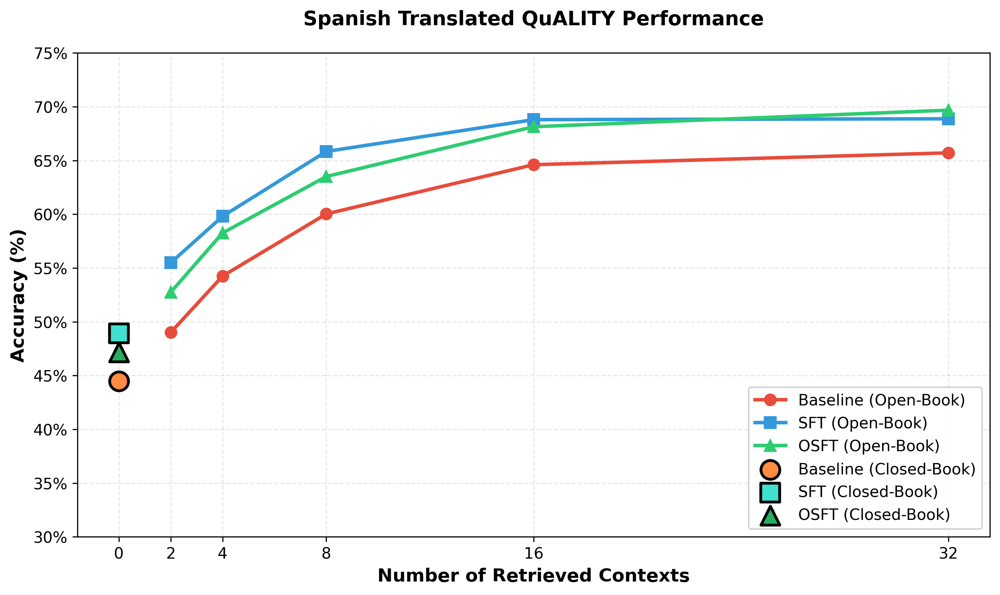

# Knowledge Tuning with Enhanced Summaries

## Objective

Pre-trained language models typically encounter most facts in their training data only **once or twice**, if at all. As a result, knowledge of specific details—especially **proprietary or domain-specific documents**—is often incomplete or missing.

This pipeline is designed to **inject new knowledge** from a given set of documents into an instruction-tuned model. By generating **multiple document augmentations** (summaries, extractive passages, atomic facts) and **synthetic Q\&A pairs**, we repeat and reinforce important information. This repetition helps the model:

* **Memorize facts** it has rarely or never seen before.
* **Generalize across augmentations**, improving reliability when queried.
* **Adapt to proprietary knowledge sources** that were absent from pre-training.

The final product is a **high-quality training dataset** suitable for fine-tuning, enabling models to answer queries more accurately and faithfully based on the injected documents.

---

## 1. Document Summarization

To bootstrap the process, we generate **three complementary types of summaries** for each source document. This ensures the model captures content at multiple levels of abstraction:

* **Detailed Summaries** – Rich, comprehensive overviews of the document.
* **Extractive Summaries** – Directly extracted sentences and passages representing the most important parts.
* **Atomic Facts** – Concise, standalone factual statements distilled from the text.

This multi-perspective approach improves the model’s ability to **memorize, generalize, and recall** key knowledge.

---

## 2. Synthetic Q\&A Generation

With summaries in place, we scale up training data via **synthetic Q\&A generation**:

* Users provide a small set of **seed examples** (initial Q\&A pairs).
* The pipeline uses these seeds to generate a large set of **contextually grounded Q\&A pairs**, tightly linked to the summarized documents.
* This expands sparse seed data into a **rich, diverse training dataset** suitable for fine-tuning.

---

## 3. Quality Control

High-quality training data is essential. To ensure faithfulness and accuracy, we employ a **teacher-model evaluation loop**:

1. Provide the model with a generated answer and the original document.
2. Ask it to extract each factual claim from the answer.
3. Verify whether each claim is **explicitly supported** by the document.

Only claims passing this check are retained. This process filters out **hallucinations and unsupported statements**, ensuring reliable Q\&A pairs.

---

## Data Generation Statistics and Results

**Teacher model for generation:** `openai/gpt-oss-120b`  
**Student model trained:** `meta-llama/Llama-3.1-8B-Instruct`  
**Training method:** Supervised Fine-Tuning (SFT)

---

### Summary Augmentation

For each document, we generate three augmentation types—detailed summaries, extractive summaries, and atomic facts. Each “cut” on the table below represents the total number of summary augmentations per document (i.e., how many times each augmentation process is run).

<table>
  <caption><b>Table 1: Token count statistics for different numbers ("cuts") of summary augmentations per document.</b></caption>
  
| Cut (NUMBER\_OF\_SUMMARIES) | Token Count   |
| ------------------------------- | ------------- |
| Input Corpus                    | 1,517,465     |
| 10                              | 87,248,889    |
| 20                              | 158,615,276   |
| 30                              | 230,306,195   |
| 40                              | 301,805,906   |
| 50                              | 373,183,414   |
</table>


---

### Benchmark Results

- **Evaluation benchmark:** [QuALITY benchmark](https://nyu-mll.github.io/quality/)
- **Evaluation script & metric:** [Synthetic_Continued_Pretraining](https://github.com/ZitongYang/Synthetic_Continued_Pretraining/blob/main/evaluation.py), Exact Match (EM)
- **Student model:** meta-llama/Llama-3.1-8B-Instruct (after SFT on generated/augmented summaries)
- **Performance metric:** Model accuracy

<p align="center">
  
</p>

<p align="center">
  <em>Figure: Model accuracy across the QuALITY benchmark datasets, comparing SFT training on enhanced document summaries with the original model performance.</em>
</p>

---

### Continued Pre-training (CPT): Data Generation and Accuracy

We performed continued pre-training (CPT) using next-token prediction on augmented documents, without applying any chat template for the model input. To improve generalization and mitigate overfitting, we incorporated **RedPajama v2** data as a replay buffer, constituting 10% of the total input tokens.

<table>
  <caption><b>Table 2: CPT data scaling and resulting model accuracy. Higher augmentation "cuts" correspond to increased training data and performance.</b></caption>
  
| Cut (NUMBER\_OF\_SUMMARIES) | Token Count  | Accuracy (%) | Method     |
|-----------------------------|--------------|--------------|------------|
| Input Corpus                | 1,517,465    | 43.67        | Baseline   |
| 50                          | 373,183,414  | 51.64        | SFT        |
| 25                          | 42,904,412   | 56.77        | CPT        |
| 50                          | 83,750,884   | 57.49        | CPT        |
</table>

Notes:
- CPT shows signs of overfitting at higher token count (number of summaries) on knowledge data.
- We use red pajama mix to prevent some of this overfitting.

---

## Multilingual Support

The knowledge generation notebook supports generating training data in **any language**. Translated flow variants are resolved automatically — if a pre-translated flow exists it is used directly, otherwise `translate_flow()` creates one on-demand using an LLM.

### Quick Start

1. Copy `.env.example` to `.env` and configure your model endpoint.
2. Set the multilingual variables:

   ```dotenv
   SDG_LANG=Spanish
   SDG_LANG_CODE=es
   ```

3. Run `knowledge_generation.ipynb` as normal. The notebook detects these variables and uses translated flows.

To revert to English, remove or leave `SDG_LANG` empty.

### Configuration Reference

| Variable | Description | Example |
|----------|-------------|---------|
| `SDG_LANG` | Target language name (empty = English) | `Spanish`, `French`, `Japanese` |
| `SDG_LANG_CODE` | ISO 639-1 language code | `es`, `fr`, `ja` |
| `TRANSLATED_FLOWS_DIR` | Directory with pre-translated flows (optional) | `./translated_flows` |
| `TRANSLATOR_MODEL` | LLM for translation (litellm format) | `openai/gpt-4o` |
| `TRANSLATOR_API_KEY` | API key for translator model | |
| `TRANSLATOR_API_BASE` | Custom API base URL (optional) | |
| `VERIFIER_MODEL` | LLM for translation verification | `openai/gpt-4o` |
| `VERIFIER_API_KEY` | API key for verifier (if different) | |
| `VERIFIER_API_BASE` | Custom API base URL for verifier (optional) | |

### How It Works

1. The notebook reads `SDG_LANG` and `SDG_LANG_CODE` from the environment.
2. For each of the four generation flows (extractive summary, detailed summary, key facts, document-based Q\&A), it checks `FlowRegistry` for a translated variant named `<Flow Name> (<Language>)`.
3. If found, it uses the existing translated flow. If not, it calls `translate_flow()` which:
   - Translates all prompt YAMLs using the configured translator model.
   - Verifies each translation with a second LLM pass.
   - Creates an adapted `flow.yaml` with updated metadata and prompt paths.
   - Registers the new flow with `FlowRegistry` for immediate use.

### Pre-translated Flows

The repository ships with **Spanish (`es`)** flows under `src/sdg_hub/flows/knowledge_infusion/enhanced_multi_summary_qa_es/`. These are auto-discovered and require no extra setup — just set `SDG_LANG=Spanish` and `SDG_LANG_CODE=es`.

### Spanish Translated QuALITY Benchmark Results

We evaluated Spanish knowledge tuning using the same QuALITY benchmark (translated to Spanish), comparing a baseline Llama-3.1-8B-Instruct model against SFT and OSFT variants trained on Spanish-translated synthetic data.

<p align="center">
  
</p>

<p align="center">
  <em>Figure: Spanish QuALITY benchmark accuracy across retrieved context sizes. SFT on translated data yields consistent gains over the baseline in both open-book and closed-book settings.</em>
</p>
